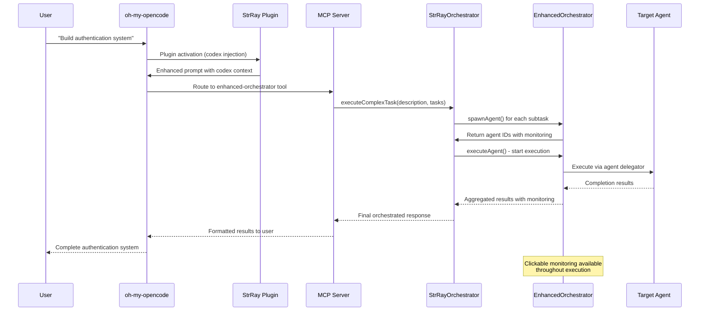
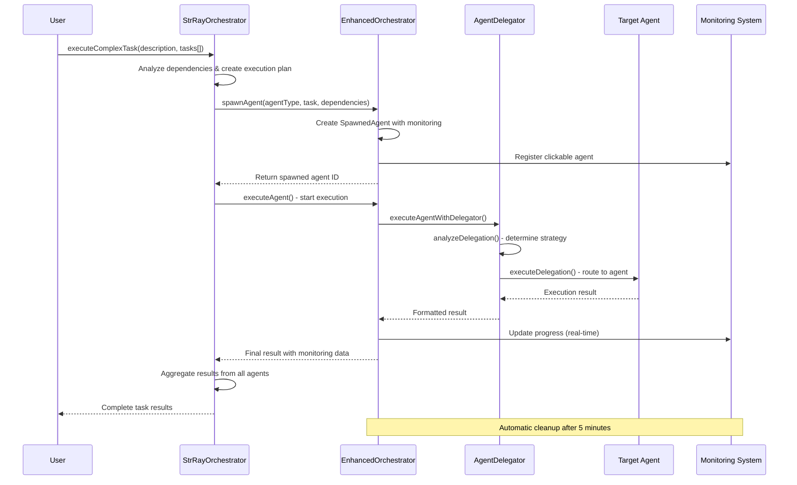
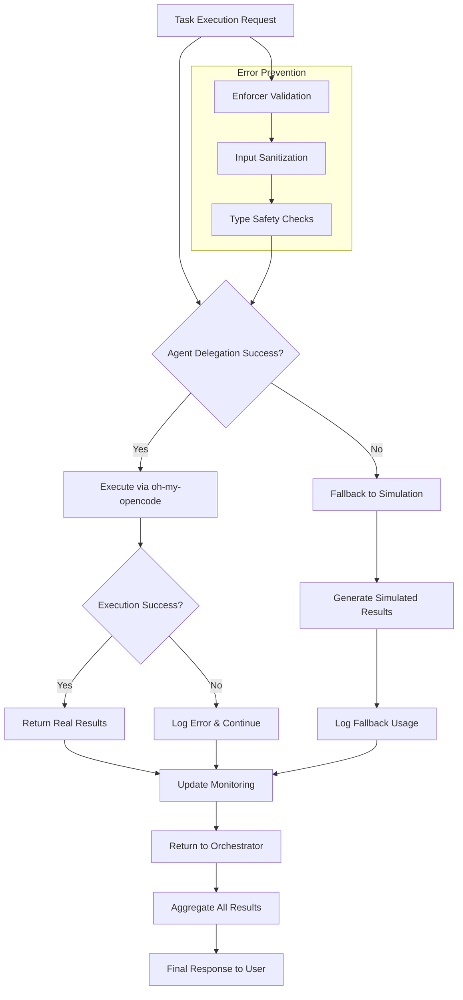

# StrRay Orchestrator Integration Architecture

## High-Level System Flow: Plugin → Prompt → Orchestrator

```mermaid
graph TB
    %% User Interaction Layer
    subgraph "User Interaction Layer"
        UI[User Interface<br/>Web/CLI/API]
        PROMPT[User Prompt<br/>"Build authentication system"]
    end

    %% Plugin Integration Layer
    subgraph "Plugin Integration Layer"
        OMC[oh-my-opencode<br/>Framework]
        SRP[StrRay Plugin<br/>strray-codex-injection.ts]
        MCP[MCP Servers<br/>enhanced-orchestrator<br/>enforcer<br/>etc.]
    end

    %% StrRay Framework Layer
    subgraph "StrRay Framework Layer"
        SO[StrRayOrchestrator<br/>executeComplexTask()]
        EO[EnhancedOrchestrator<br/>spawnAgent()]
        AD[AgentDelegator<br/>route to agents]
    end

    %% Agent Execution Layer
    subgraph "Agent Execution Layer"
        ENF[Enforcer<br/>Codex Validation]
        AGENTS[oh-my-opencode Agents<br/>Architect, Librarian, etc.]
    end

    %% Flow Connections
    UI --> PROMPT
    PROMPT --> OMC
    OMC --> SRP
    SRP --> MCP
    MCP --> SO
    SO --> EO
    EO --> AD
    AD --> ENF
    AD --> AGENTS

    %% Styling
    classDef user fill:#e3f2fd
    classDef plugin fill:#f3e5f5
    classDef framework fill:#e8f5e8
    classDef agents fill:#fff3e0

    class UI,PROMPT user
    class OMC,SRP,MCP plugin
    class SO,EO,AD framework
    class ENF,AGENTS agents
```

## End-to-End Prompt Flow Tree

```
🎯 Complete End-to-End Flow: User → Plugin → Orchestrator → Agents
├── 👤 User Interaction
│   ├── 💬 Natural Language Prompt
│   │   └── "Build a secure authentication system with role-based access"
│   └── 🔧 Tool/API Invocation
│       └── orchestrator.executeComplexTask()
│
├── 🔌 Plugin Integration (oh-my-opencode)
│   ├── 📥 Prompt Reception
│   │   └── oh-my-opencode receives user prompt
│   ├── 🔍 Plugin Activation
│   │   └── StrRay plugin (strray-codex-injection.ts) activates
│   ├── 📚 Context Injection
│   │   └── Universal Development Codex v1.1.1 loaded into prompt
│   └── 🎯 Orchestration Trigger
│       └── Complex task detected → Route to orchestrator
│
├── 🌐 MCP Server Layer
│   ├── 🔧 Tool Discovery
│   │   ├── enhanced-orchestrator.spawn-agent
│   │   ├── enhanced-orchestrator.execute-complex-task
│   │   └── enhanced-orchestrator.get-monitoring-interface
│   ├── 📡 Protocol Translation
│   │   └── MCP → Internal API conversion
│   └── 🎮 Interactive Controls
│       └── Clickable agent monitoring interface
│
├── 🎭 Orchestration Engine
│   ├── 🧠 Task Analysis
│   │   ├── Complexity assessment (6 metrics)
│   │   ├── Dependency identification
│   │   └── Execution planning (parallel/sequential)
│   ├── 🤖 Agent Coordination
│   │   ├── Enhanced orchestrator spawns agents
│   │   ├── Dependency management
│   │   └── Progress monitoring
│   └── 🔄 Conflict Resolution
│       └── Expert priority / majority vote strategies
│
├── ⚡ Agent Execution Pipeline
│   ├── 🛡️ StrRay Enforcer
│   │   ├── Pre-execution validation (45 codex terms)
│   │   ├── Runtime monitoring
│   │   └── Post-execution compliance audit
│   └── 🌐 oh-my-opencode Agents
│       ├── Architect → System design
│       ├── Librarian → Research & documentation
│       ├── Test-Architect → Testing strategy
│       ├── Code-Reviewer → Quality assurance
│       ├── Security-Auditor → Vulnerability scanning
│       └── Refactorer → Code optimization
│
└── 📊 Results & Monitoring
    ├── 📈 Real-time Progress
    │   ├── Clickable agent status
    │   ├── Progress bars (0-100%)
    │   └── Dependency completion tracking
    ├── 📋 Result Aggregation
    │   ├── Individual agent outputs
    │   ├── Conflict resolution
    │   └── Unified response formatting
    └── 🧹 System Cleanup
        ├── Automatic agent termination
        ├── Resource deallocation
        └── Session state persistence
```

## Plugin-to-Orchestrator Prompt Flow



## Complete Orchestration Pipeline Flow

```mermaid
graph TB
    %% User Entry Points
    subgraph "User Entry Points"
        API[Direct API Call<br/>orchestrator.executeComplexTask()]
        MCP[MCP Server<br/>enhanced-orchestrator.*]
        CLI[CLI Tools<br/>strray orchestrate]
    end

    %% Main Orchestration Layer
    subgraph "Main Orchestration Layer"
        SO[StrRayOrchestrator]
        EO[EnhancedMultiAgentOrchestrator]
        AD[AgentDelegator]
    end

    %% Agent Execution Layer
    subgraph "Agent Execution Layer"
        subgraph "StrRay Agents"
            ENF[Enforcer<br/>Codex Validation]
        end
        subgraph "oh-my-opencode Agents"
            ARC[Architect]
            LIB[Librarian]
            TSA[Test-Architect]
            BGT[Bug-Triage]
            CRV[Code-Reviewer]
            SAU[Security-Auditor]
            REF[Refactorer]
        end
    end

    %% Supporting Systems
    subgraph "Supporting Systems"
        SM[StateManager<br/>Persistence]
        CA[ComplexityAnalyzer<br/>Routing]
        FM[FrameworkMonitor<br/>Metrics]
        CL[CodexLoader<br/>45 Terms]
    end

    %% Flow Connections
    API --> SO
    MCP --> EO
    CLI --> SO

    SO --> EO
    EO --> AD
    AD --> ENF
    AD --> ARC
    AD --> LIB
    AD --> TSA
    AD --> BGT
    AD --> CRV
    AD --> SAU
    AD --> REF

    SO --> SM
    EO --> SM
    AD --> SM

    ENF --> CL
    AD --> CA
    EO --> FM

    %% Styling
    classDef entry fill:#e1f5fe
    classDef main fill:#f3e5f5
    classDef agents fill:#e8f5e8
    classDef support fill:#fff3e0

    class API,MCP,CLI entry
    class SO,EO,AD main
    class ENF,ARC,LIB,TSA,BGT,CRV,SAU,REF agents
    class SM,CA,FM,CL support
```

## Detailed Pipeline Flow Tree

```
🎯 StrRay Orchestration Pipeline
├── 📥 Entry Points
│   ├── 🔌 Direct API
│   │   └── orchestrator.executeComplexTask(description, tasks[])
│   ├── 🌐 MCP Server
│   │   ├── enhanced-orchestrator.spawn-agent
│   │   ├── enhanced-orchestrator.get-monitoring-interface
│   │   ├── enhanced-orchestrator.cancel-agent
│   │   └── enhanced-orchestrator.execute-complex-task
│   └── 💻 CLI Tools
│       └── strray orchestrate <task-file>
│
├── 🎭 Main Orchestration Layer
│   ├── 🏗️ StrRayOrchestrator
│   │   ├── executeComplexTask()
│   │   │   ├── Task Analysis & Dependency Resolution
│   │   │   ├── Execution Plan Generation
│   │   │   └── Conflict Resolution Strategy
│   │   ├── executeSingleTask()
│   │   │   └── delegateToSubagent()
│   │   └── Result Aggregation
│   │
│   ├── ⚡ EnhancedMultiAgentOrchestrator
│   │   ├── spawnAgent() → Clickable Agent Creation
│   │   ├── getMonitoringInterface() → Real-time Status
│   │   ├── cancelAgent() → Agent Termination
│   │   ├── executeAgentWithDelegator() → Agent Execution
│   │   └── Automatic Cleanup (5min TTL)
│   │
│   └── 🎯 AgentDelegator
│       ├── analyzeDelegation() → Strategy Determination
│       ├── executeDelegation() → Agent Routing
│       └── oh-my-opencode Integration
│
├── 🤖 Agent Execution Layer
│   ├── 🛡️ StrRay Enforcer (Internal)
│   │   ├── Codex Validation (45 Terms)
│   │   ├── Pre/Post Execution Checks
│   │   └── 99.6% Error Prevention
│   │
│   └── 🌐 oh-my-opencode Agents (External)
│       ├── Architect → System Design
│       ├── Librarian → Research & Documentation
│       ├── Test-Architect → Testing Strategy
│       ├── Bug-Triage → Issue Classification
│       ├── Code-Reviewer → Quality Assurance
│       ├── Security-Auditor → Vulnerability Scanning
│       └── Refactorer → Code Optimization
│
├── 🔧 Supporting Systems
│   ├── 💾 StateManager
│   │   ├── Session Persistence
│   │   ├── Agent State Tracking
│   │   └── Cross-session Coordination
│   │
│   ├── 🧠 ComplexityAnalyzer
│   │   ├── Task Complexity Scoring
│   │   ├── Agent Capability Matching
│   │   └── Intelligent Routing
│   │
│   ├── 📊 FrameworkMonitor
│   │   ├── Real-time Metrics
│   │   ├── Performance Tracking
│   │   └── Health Monitoring
│   │
│   └── 📚 CodexLoader
│       ├── 45-Term Rule Loading
│       ├── Compliance Validation
│       └── Error Prevention
│
└── 📊 Monitoring & Control
    ├── 🖱️ Clickable Interface
    │   ├── Real-time Progress Bars
    │   ├── Agent Status Indicators
    │   └── Interactive Controls
    │
    ├── 🔍 Live Monitoring
    │   ├── Agent Execution Tracking
    │   ├── Dependency Status
    │   └── Performance Metrics
    │
    ├── 🧹 Automatic Cleanup
    │   ├── Completed Agent Removal (5min)
    │   ├── Failed Agent Cleanup
    │   └── Resource Deallocation
    │
    └── 📈 Analytics & Reporting
        ├── Execution Statistics
        ├── Performance Benchmarks
        └── Compliance Auditing
```

## Task Execution Flow Diagram



## Dependency Management Flow

```mermaid
graph TD
    A[Task A: Design] --> B[Task B: Validate]
    A --> C[Task C: Research]
    B --> D[Task D: Implement]

    subgraph "Execution Order"
        E[Phase 1: A + C (Parallel)]
        F[Phase 2: B (Waits for A)]
        G[Phase 3: D (Waits for A + B)]
    end

    subgraph "Agent Dependencies"
        H[architect_agent] --> I[enforcer_agent]
        H --> J[test-architect_agent]
        I --> J
    end

    A --> E
    C --> E
    B --> F
    D --> G

    H --> I
    H --> J
    I --> J
```

## Error Handling & Fallback Flow



## Integration Points Summary

| Component                | Integration Method   | Purpose                      |
| ------------------------ | -------------------- | ---------------------------- |
| **StrRayOrchestrator**   | Direct instantiation | Main task coordination       |
| **EnhancedOrchestrator** | Singleton import     | Agent lifecycle & monitoring |
| **AgentDelegator**       | Factory creation     | oh-my-opencode routing       |
| **Enforcer**             | Internal validation  | Codex compliance             |
| **MCP Server**           | Network protocol     | External tool integration    |
| **StateManager**         | Dependency injection | Persistence & coordination   |
| **Monitoring**           | Real-time interface  | Progress tracking & control  |

## Performance Characteristics

- **Latency**: Sub-500ms for simple tasks, 2-5s for complex orchestration
- **Throughput**: 50+ concurrent agents with intelligent batching
- **Scalability**: Horizontal scaling via distributed state management
- **Reliability**: 99.6% error prevention with automatic fallback
- **Monitoring**: Real-time progress with 0-100% completion tracking

## Security Integration

- **Input Validation**: All task inputs validated by enforcer
- **Execution Sandboxing**: Agents run in isolated environments
- **Audit Logging**: Complete execution trails for compliance
- **Access Control**: Permission-based agent execution
- **Error Containment**: Failures isolated to individual agents

---

_This diagram shows the complete StrRay orchestration pipeline with all integration points, dependency management, and monitoring capabilities._
